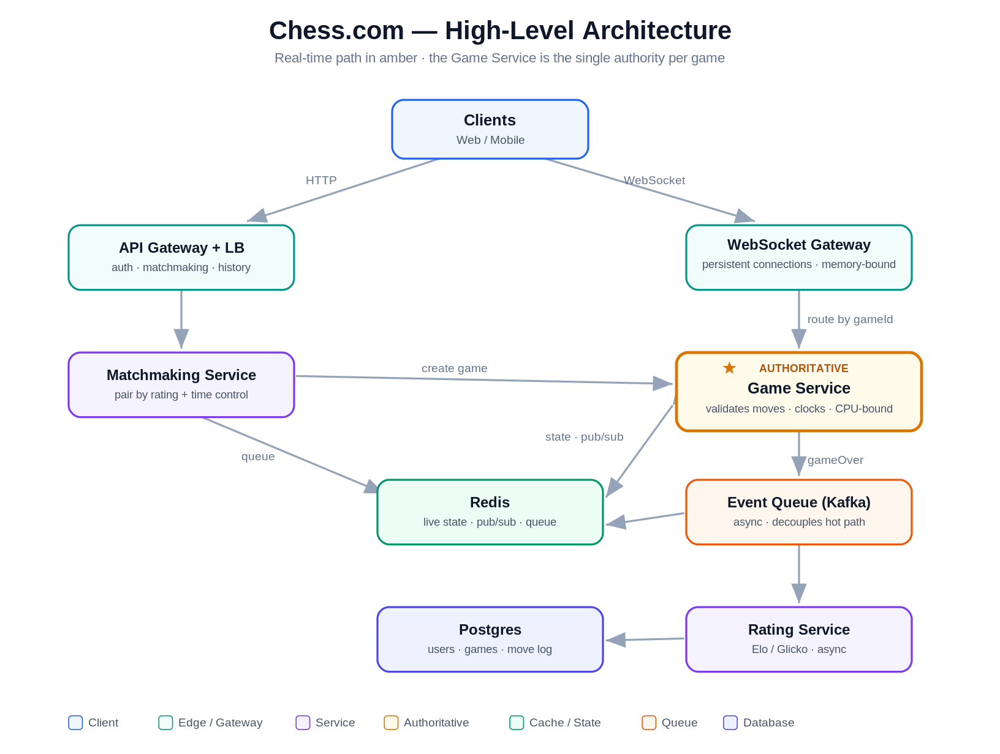

# System Design: Design Chess.com

> This is the exact prompt Vishnu got from Eric. Treat it as your most-likely question. **Internalize the structure and the 5 "senior signals" below — don't recite this verbatim.** The interviewer is grading how you scope, structure, and reason about tradeoffs, not whether you reproduce one canonical answer.

**The 5 senior signals to make sure you hit (if you only remember 5 things):**
1. **Server is authoritative** — validate every move server-side (this is your anti-cheat and your consistency story).
2. **Split the WebSocket gateway from the game server** — connections are memory-bound, game logic is CPU-bound; scale them independently.
3. **Chess is event-sourced** — the move list IS the source of truth; the board (FEN) is a derived/replayable view.
4. **Keep the DB out of the per-move critical path** — active game state lives in memory/Redis; persist async.
5. **Don't over-engineer day one** — chess.com ran on a single MySQL for years. Start simple, scale when load demands it. Saying this signals judgment.

---

## 0. How to open (first 60 seconds)

> "Chess.com is broad, so I'll start by clarifying scope and the must-have features, throw out a couple of scale assumptions, then design the core real-time game path end-to-end before layering on matchmaking, ratings, scaling, and reliability. I'll call out tradeoffs as I go — stop me anywhere you want to go deeper."

This one sentence shows you can take an open-ended prompt and impose structure. Then run the steps below.

---

## 1. Requirements (clarify, don't assume)

Ask which of these are in scope, then propose a v1.

**Functional (propose this v1):**
- Real-time **1v1 live games** (the core).
- **Matchmaking** — pair players by rating + time control.
- **Move handling** with **server-side validation** (legal move? whose turn?).
- **Clocks/timers** per player (bullet/blitz/rapid), server-authoritative.
- **Game-end detection** — checkmate, stalemate, resignation, timeout (flag-fall), draw (agreement, threefold repetition, 50-move, insufficient material).
- **Reconnection** — a player drops and rejoins the same game.
- **Ratings** — update both players after the game (Elo/Glicko).
- **Game history / replay** — store the moves.

**Stretch / mention then scope out:** spectating, in-game chat, puzzles, lessons, the chess *engine/bot* (a hard separate problem), tournaments, anti-cheat ML, payments, video. Naming them and deferring shows scoping discipline.

**Non-functional:**
- **Low latency** on moves — server processing in the low tens of ms; should feel instant.
- **Strong consistency within a single game** — both players must always see the same board. (Trivially achievable because each game has *one* authoritative owner.)
- **High availability** and **durability** — never lose a finished game; survive a server crash mid-game.
- **Fairness / anti-cheat** — never trust the client; server owns the rules and the clock.
- **Scale** — hundreds of thousands of concurrent connections, tens of thousands of concurrent games.

---

## 2. Back-of-the-envelope scale (2–3 numbers, then move on)

- Assume ~10M DAU (Daily Active Users), ~100k–200k concurrent players at peak → ~**50k–100k concurrent games**.
- Each game: 2 players, a handful of moves/minute → **move throughput is modest** (tens of thousands of messages/sec peak — i.e. low QPS, *Queries Per Second*), but there are **hundreds of thousands of persistent connections**.

**What the numbers tell us (this is the point of estimating):**
- Many long-lived connections → a **horizontally scaled WebSocket layer**.
- Per-game state is tiny → keep it **hot in memory/Redis**, not in the DB.
- Writes are **append-only move events** → cheap and easy to persist/archive.
- Finished games need **durable storage**, but not on the hot path.

---

## 3. API & real-time events

**HTTP / REST — non-realtime** (REST = *Representational State Transfer*, the standard request/response web-API style):
```
POST   /matchmaking/join     { userId, timeControl }   → enqueue
DELETE /matchmaking/leave    { userId }
GET    /games/{gameId}        → full game record for replay
GET    /users/{userId}/rating
```

**WebSocket messages — realtime, bidirectional (moves go here, NOT over HTTP):**
```
client → server:  makeMove { gameId, move }      // move in SAN or UCI
                  resign   { gameId }
                  offerDraw / acceptDraw { gameId }
                  heartbeat
server → client:  matched          { gameId, color, opponent }
                  moveApplied      { move, fen, whiteClock, blackClock }
                  gameOver         { result, reason, ratingDelta }
                  opponentLeft     { graceDeadline }
                  error            { code, message }
```
**Say why WebSocket, not polling:** moves need *server push* (your opponent's move arrives without you asking) and *low latency*. Polling wastes requests and adds delay; SSE (Server-Sent Events — a one-way server→client push stream, no client→server channel) doesn't let the client send moves. WebSocket = persistent, bidirectional.

---

## 4. Data model

```
Users(id, username, ratings_by_timecontrol, created_at, ...)
Games(id, white_id, black_id, time_control, status, result, started_at, ended_at)
Moves(game_id, ply, move_uci, clock_remaining_ms, ts)   -- ordered, append-only
RatingHistory(user_id, game_id, old, new, delta, ts)     -- optional
```
- **Source of truth = the ordered move list** (event sourcing). The current board (**FEN**) is a *derived* view you can rebuild by replaying moves. Store the final game as **PGN** for replay.
- **Active game state is ephemeral** → lives in **Redis**, not a table:
  `game:{id} → { fen, turn, whiteClock, blackClock, players, lastMoveTs }`

**SQL vs NoSQL:**
- `Users`, `Games`, `RatingHistory` → **relational (Postgres)** — structured, need consistency and queries.
- `Moves` → append-only and immutable; fine in Postgres (partition by time) or a write-optimized store. Volume is easy either way.
- **Key line:** *"The database should not be in the critical path of every WebSocket move — that lives in memory/Redis; the DB is for durability and history."*

---

## 5. High-level architecture



*The real-time move path flows Clients → WebSocket Gateway → Game Service; the **Game Service** (amber) is the single authority per game. Matchmaking pairs players and creates the game; **Redis** holds live state and fans out via pub/sub; ratings and persistence run **async** off the Kafka event queue, keeping the database off the per-move hot path.*

**Components:**
- **API Gateway / Load Balancer** — auth, matchmaking requests, history reads.
- **WebSocket Gateway fleet** — owns the persistent client connections; forwards game messages to the right game server. *Memory-bound.*
- **Game Service** — the authoritative brain: validates moves, enforces turns, runs clocks, detects game end. Each active game is a small **state machine**. *CPU-bound.*
- **Redis** — active game state (fast read/write), **pub/sub** for fan-out, matchmaking queue (sorted set by rating), leaderboards.
- **Kafka / event queue** — async pipeline for rating updates, persistence, analytics, anti-cheat.
- **Postgres** — durable users, games, moves, rating history.
- **Rating Service** — consumes `gameOver` events, computes new ratings.

---

## 6. Deep dives (where you win the interview)

### 6.1 The move flow — the heart of the system
When player A makes a move:
```
1. Client A sends makeMove{gameId, move} over its WebSocket.
2. The Game Service (authoritative) checks, in order:
     - Is this game active?
     - Is it player A's turn?
     - Is the move legal in the current position?   ← rules engine
     - Has A's clock not already expired?
   If any check fails → reject with an error (this is anti-cheat).
3. Apply the move: update FEN, switch turn, deduct elapsed time from A's
   clock (+ increment), set lastMoveTs.
4. Append the move to the event log (source of truth); back up state to Redis.
5. Broadcast moveApplied{move, fen, clocks} to player B (and spectators).
6. If the move ends the game (mate/stalemate/etc.) → emit gameOver and
   enqueue a rating-update event to Kafka.
```
**Anti-cheat framing:** the client only *requests* a move; the server decides if it's legal. A malicious client can't make illegal moves, move out of turn, or fake its clock. (Human cheating *with an engine* is a separate, offline ML/analytics problem — name it and scope it out.)

### 6.2 Real-time connection architecture — the WS-gateway / game-server split ⭐
This is the highest-value point.
- **WebSocket gateways are memory-bound** — they hold huge numbers of mostly-idle connections, little CPU. **Game servers are CPU-bound** — move validation and rules logic. **Separate them so each scales on its own axis.**
- **The routing problem:** both players in a game must act on the *same* authoritative state. Two ways to solve it:
  - **(a) Sticky routing by `gameId`** (consistent hashing): both players' messages route to the one game server that owns that game; state stays in that server's memory → lowest latency. Cost: rebalancing on server add/remove is trickier.
  - **(b) Stateless game servers + state in Redis + pub/sub:** any server handles a move, reads/writes the game in Redis, then publishes to a `game:{id}` channel; gateways subscribed to that channel push to the right sockets. Cost: a Redis round-trip per move; benefit: simpler failover.
- **Practical answer:** keep active state in the owning game server's memory for speed, **and** mirror it to Redis so another server can recover the game if that one dies. State the tradeoff explicitly — that's the senior move.

### 6.3 Clocks & timeouts (subtle — interviewers love this)
- **Server is the source of truth for time.** On each move, deduct `now - lastMoveTs` from the mover's clock and add the increment; store `lastMoveTs`.
- **Flag-fall when idle:** if a player just sits there, no message arrives to trigger the check — so run a **per-game timeout timer** (a scheduled check at the active player's deadline) so the game can end on time even with zero input.
- **Latency fairness:** timestamp on server receipt; some systems add small lag compensation so a laggy player isn't unfairly flagged. Mention briefly, don't rabbit-hole.

### 6.4 Matchmaking
- Players **join a queue per time control**. Match by **closest rating**, **widening the acceptable rating band as wait time grows** (fast match vs fair match tradeoff).
- Implement with a **Redis sorted set keyed by rating**; pull nearby candidates. Needs a large enough active pool for quick pairings.
- On match: create the `Games` record, initialize state in Redis, send `matched{gameId, color, opponent}` to both clients, which then play over their WebSockets.

### 6.5 Reconnection & fault tolerance
- **Player disconnects:** don't end the game immediately — start a **grace timer** and let them **reconnect and rehydrate** state from Redis / the move log. If the timer expires → forfeit or abort per rules.
- **Game server crashes:** because live state is mirrored to **Redis** (and fully reconstructable from the **append-only move log**), another server picks the game up and clients reconnect — the game survives.
- **Design principle:** every layer assumes the one below can fail — Redis backs the game servers, the durable move log backs Redis, clients reconnect to the gateways.

### 6.6 Ratings (async, decoupled)
- On `gameOver`, emit an event to **Kafka**. The **Rating Service** consumes it, computes Elo/Glicko, updates both users, and writes rating history.
- **Async** because ratings aren't latency-critical and you don't want them on the move path.
- **Idempotency:** key the event by `gameId` so a redelivered event doesn't double-apply a rating change.

---

## 7. Scaling & bottlenecks

- **WebSocket gateways** scale by connection count; **game servers** scale by sharding on `gameId`. Both horizontal and stateless-ish (state in Redis).
- **Redis** → cluster/shard by `gameId`; watch **hot keys** (a hugely-spectated top game).
- **Postgres** → read replicas for history; the `games`/`moves` tables grow forever, so **partition by time and archive** old games (they're immutable — cheap to cold-store).
- **Spectators** can dwarf players for a viral game → fan out via **pub/sub**; spectators are read-only subscribers fully **decoupled** from the players' path; for extreme cases use a dedicated broadcast/fan-out tier.
- **Leaderboards** → Redis **sorted sets**.
- **Multi-region** → route players to the nearest region for latency; cross-region matches are genuinely hard (you can't beat the speed of light) — name it as a real challenge / future work.
- **Don't over-engineer:** chess.com famously ran on a single MySQL for years. Start with one DB + app servers; add Redis → sharding → multi-region **as traffic demands**. Say this — it signals maturity over cargo-culting microservices.

---

## 8. Reliability, security, observability

- **Consistency:** a single game is strongly consistent because it has exactly **one authoritative writer** (the owning game server, with atomic Redis ops). Different games are independent → trivially parallel.
- **Reliability:** timeouts, retries with backoff, **idempotent** event handling, health checks, graceful degradation.
- **Security:** authenticate on WS connect (token); authorize every action (you can only move in *your* game, only on *your* turn); validate all input; rate-limit; anti-cheat via server-authoritative rules + offline engine-detection analytics.
- **Observability:** per-game request IDs, structured logs (no excessive PII), metrics (move latency, active games & connections, matchmaking wait time), traces, and alerts on latency/error spikes.

---

## 9. Tradeoffs to say out loud (the senior-engineer tax)

| Decision | Option A | Option B | Pick & why |
|---|---|---|---|
| Game state | In-memory/Redis (fast) | DB per move (durable, slow) | A + event log + Redis backup — keep DB off the hot path |
| Routing | Sticky by gameId (low latency) | Stateless + Redis (resilient) | Sticky for speed, mirror to Redis for failover |
| Move transport | WebSocket | HTTP polling / SSE | WebSocket — push + low latency, bidirectional |
| Ratings/persistence | Sync | Async via queue | Async — not latency-critical, decouples |
| Day-1 complexity | Microservices everywhere | One DB, scale later | Start simple; scale on real load |

---

## 10. Likely follow-ups (have a crisp 2–3 sentence answer ready)

- **"How do you prevent cheating?"** → Server validates every move (legality, turn, clock); client can never force an illegal/out-of-turn move. Engine-assisted human cheating is a separate offline ML/analytics problem.
- **"What if a game server crashes mid-game?"** → State is mirrored to Redis and fully rebuildable from the append-only move log; another server resumes it, clients reconnect.
- **"A player's clock runs out while they're disconnected — what happens?"** → Server is the time authority and runs a per-game timeout timer, so flag-fall fires even with no incoming message.
- **"How do both players see the same board?"** → One authoritative owner per game serializes moves; clients render server-confirmed state only (optimistic UI optional, but server is truth).
- **"Why WebSockets?"** → Need server push and low latency; polling is wasteful and laggy, SSE is one-way.
- **"How do you scale spectators for a viral game?"** → Read-only pub/sub fan-out, fully decoupled from players, with a dedicated broadcast tier if needed.
- **"How does matchmaking stay fair *and* fast?"** → Match on closest rating, widen the band as wait grows; Redis sorted set by rating.
- **"Draw rules / threefold / 50-move?"** → Handled by the rules engine inside move validation, which has full game history (it's event-sourced).

---

## 11. Closing (30 seconds)

> "To recap: clients connect over WebSockets to a gateway tier that's split from an authoritative game-service tier; the game server validates every move, owns the clock, keeps live state in memory backed by Redis, and the move log is the event-sourced source of truth; ratings and persistence happen async off a queue. It starts simple and scales by sharding games and fanning out spectators via pub/sub. With more time I'd dig into multi-region play, engine-based anti-cheat, and spectator fan-out at very large scale."

---

## Appendix — glossary & acronyms

**Chess-specific**
- **FEN** (Forsyth–Edwards Notation) — a string encoding the full board position at a moment (the *derived* state).
- **PGN** (Portable Game Notation) — the standard text format for a whole game's move list (for storage/replay).
- **SAN / UCI** — move notations. **SAN** = *Standard Algebraic Notation*, human-readable ("Nf3"). **UCI** = *Universal Chess Interface*, machine-friendly from→to ("g1f3"); easier to parse programmatically.
- **Elo / Glicko** — player rating systems updated after each game (Glicko adds a reliability/deviation term).
- **Flag-fall** — losing on time when your clock hits zero.

**Networking / API**
- **HTTP** (HyperText Transfer Protocol) — the standard request/response protocol of the web.
- **REST** (Representational State Transfer) — the conventional style for request/response web APIs over HTTP.
- **API** (Application Programming Interface) — the defined set of operations a service exposes to callers.
- **LB** (Load Balancer) — spreads incoming traffic across many identical servers.
- **WebSocket** — a persistent, two-way (bidirectional) connection between client and server; ideal for real-time push.
- **SSE** (Server-Sent Events) — a one-way server→client push stream over HTTP; the client can't send back on it.
- **Polling** — the client repeatedly asks "anything new?" on a timer; simple but wasteful and laggy.
- **QPS** (Queries Per Second) — a throughput measure: how many requests the system handles per second.
- **DAU** (Daily Active Users) — number of unique users active in a day; a rough scale input.

**Infrastructure**
- **Redis** — an in-memory data store; very fast, used here for live game state, pub/sub, queues, and leaderboards.
- **Kafka** — a distributed event/message queue (log) for async, decoupled processing between services.
- **Postgres** (PostgreSQL) — a relational SQL database; the durable source of truth for users, games, and moves.
- **Pub/Sub** (Publish/Subscribe) — publish a message to a channel; all subscribers receive it (used for fan-out to opponent + spectators).
- **Sticky routing / consistent hashing** — always send a given key (gameId) to the same server.
- **Sharding / partitioning** — splitting data across servers by a key (e.g. gameId) so it scales.
- **Idempotency** — designing an operation so doing it twice has the same effect as once (e.g. a gameId-keyed event won't double-apply a rating).
- **CPU-bound vs memory-bound** — limited mainly by processing (game logic) vs by RAM/connections held (the WebSocket gateway).
- **Event sourcing** — store the sequence of events (moves) as truth; derive current state by replaying them.
- **State machine** — a component with defined states and legal transitions (a chess game: whose-turn, check, mate, draw…).
